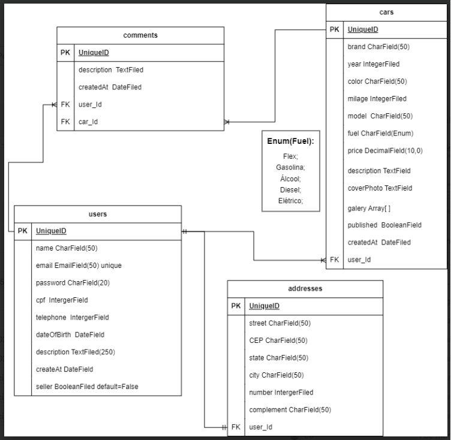

<p align="center">
  <a href="http://nestjs.com/" target="blank"></a>
</p>

# Olá, sejá bem vindo ao Back End => Motors Shop

## Tabela de Conteúdos

- [Visão Geral](#1-visão-geral)
- [Diagrama ER](#2-diagrama-er)
- [Início Rápido](#3-início-rápido)
  - [Instalando dependências](#31-instalando-dependências)
  - [Variáveis de ambiente](#32-variáveis-de-ambiente)
  - [Migrations](#33-migrations)
  - [Rodando a aplicação](#34-rodando-a-aplicação)
- [Endpoints](#4-endpoints)

---

## 1. Visão Geral

[ Voltar para o topo ](#tabela-de-conteúdos)

Trata-se de uma API que gerencia um CRUD completo de usuarios, carros, comentarios, sendo possível criar um usuário e escolher entre comprador ou vendedor, o vendedor pode cadastrar carros para vender, colocando as informações do carro e buscar o valor da fipe pela API Kenzie Kars (https://kenzie-kars.herokuapp.com/). Qualquer usuario pode comentar des de que esteja logado e com o Token ativo.
A aplicação tambem permite o usuario a recuperar su senha atravez do e-mail cadastrado.

- [NodeJS](https://nodejs.org/en/)
- [Nest](https://nestjs.com/)
- [TypeScript](https://www.typescriptlang.org/)
- [PostgreSQL](https://www.postgresql.org/)
- [Prisma](https://www.prisma.io/)
- [Passaport JWT](https://www.passportjs.org/packages/passport-jwt/)
- [Swegger](https://swagger.io/docs/)

A URL base da aplicação: http://localhost:3001

---

## 2. Diagrama

[ Voltar para o topo ](#tabela-de-conteúdos)

Diagrama ER da API definindo as relações entre as tabelas do banco de dados.



---

## 3. Início Rápido

[ Voltar para o topo ](#tabela-de-conteúdos)

### 3.1. Instalando Dependências

Clone o projeto em sua máquina e instale as dependências com o comando:

```shell
npm install
```

### 3.2. Variáveis de Ambiente

Em seguida, crie um arquivo **.env**, copiando o formato do arquivo **.env.example**:

```
cp .env.example .env
```

Configure suas variáveis de ambiente com suas credenciais do Postgres, uma nova database da sua escolha e a chave-secreta.

### 3.3. Migrations

Execute as migrations com o comando:

```
npx prisma migrate dev
```

### 3.4 Rodando a aplicação

Para rodar a aplicação, utilize o comando:

```
npm run start:dev
```

---

## 4. Endpoints

[ Voltar para o topo ](#tabela-de-conteúdos)

Para acessar os endpoints e a documentação, rode a aplicação e acesse em seu navegador: http://localhost:3001/doc


Obs: Acesse o repositório Frone End deste projeto.
[Link Frontend](https://github.com/grupo7-t14-Alex/Final-Project_Front-End_G7)
